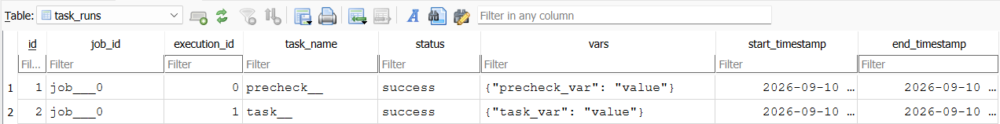

# ingestion-pipelines-orchestrator

Lightweight orchestrator library for running custom tasks in data ingestion pipelines.
Created for further personal use.


A `Job` executes one or more `Task`s.

```
from orchestrator.job import Job

from templates.precheck_template import init_precheck__
from templates.task_template import init_task__


def run_job__():
    job = Job('job__')
    job.to_execute = [
        init_precheck__(),  # a precheck is just a smaller Task, 
        init_task__(force_refresh=False),
    ]
    job.run()
```


Task execution details are stored in a local database, defined in `db.py`:

```
db_file_path = PROJECT_DIR / 'db.sqlite'
```




A task is defined as below. 

Wrapper `self.log_info()` method for logging (via `logger` library) can call log messages defined in a dictionary using their keys.

`self.vars` is a dict containing any task variables or flags. Its values are stored in the task execution details, and additionally printed after task execution.

`self.status` must be set during task execution to either: TaskStatus.SUCCESS, TaskStatus.FAILED, TaskStatus.SKIPPED.

```
from orchestrator.task import Task
from orchestrator.schemas import TaskStatus


def init_task__(force_refresh: bool = False):
    return Task(
        'task__',
        fn,
        log_messages,
        force_refresh=force_refresh,
    )


def fn(self: Task, force_refresh: bool = False):
    self.log_info('start_task')

    self.vars = {
        'task_var': 'value',
    }

    self.status = TaskStatus.SUCCESS

    self.log_info('end_task')


log_messages = {
    'start_task': 'TASK_START: start_task',
    'end_task': 'TASK_END: end_task',
}
```

```
python .\app\tests.py
precheck__ success {'precheck_var': 'value'}
INFO:job___0:task__:TASK_START: start_task
INFO:job___0:task__:TASK_END: end_task
task__ success {'task_var': 'value'}
```
